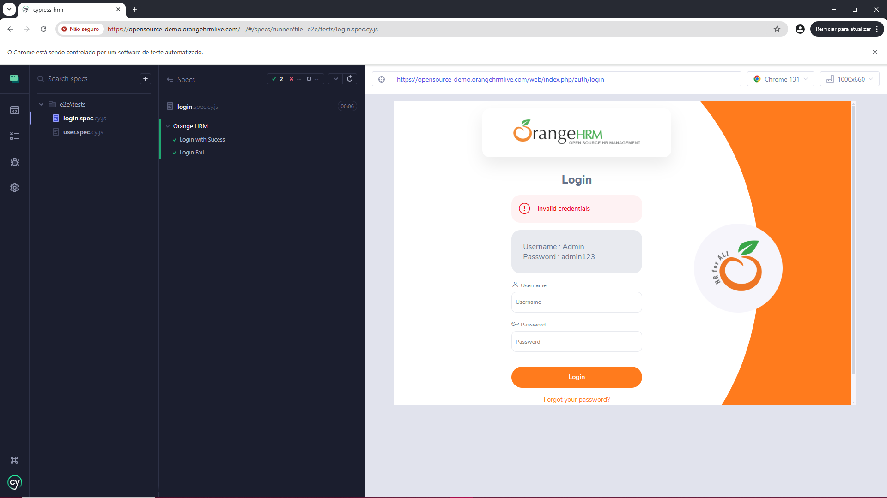

# Automação Cypress Orange HRM




Automação E2E com Cypress para o sistema OrangeHRM, utilizando a arquitetura Page Objects. Testes implementados para os módulos Login, Dashboard e My Info, com foco em escalabilidade e manutenção fácil. O projeto demonstra boas práticas em automação de testes e estruturas reutilizáveis, garantindo eficiência e qualidade.

## ⚙️ Antes Installar

O comando npm install chance instala a biblioteca Chance.js, que é uma ferramenta simples e poderosa para gerar dados aleatórios em JavaScript. Ele foi utilizado neste projeto e será necessário.

```bash
npm install chance
```
## ✅ Pre Requisitos

> **💡 NOTA:**
> 
> È necessário ter o [Node.js](https://nodejs.org)  instalado

## 📝 Passo a Passo para Instalação

**1.** **Clone o repositório na sua maquina 🖥️**

```bash
git clone https://github.com/ElizabethGomes-QAEngineer/Automacao-Cypress-OrangeHRM.git
```

**2.** **Navegue até o diretório do projeto 📂**

```bash
cd cypress-hrm
````


**3.** **Instale as dependências do projeto 📦**

```bash
npm install
```

**4.** **Execute o Cypress para rodar os testes 🚀**

abrir o Cypress com interface gráfica (GUI - Graphical User Interface)

```bash
npx cypress open
````

executar no modo headless (sem interface gráfica)

```bash
npx cypress run 
```


